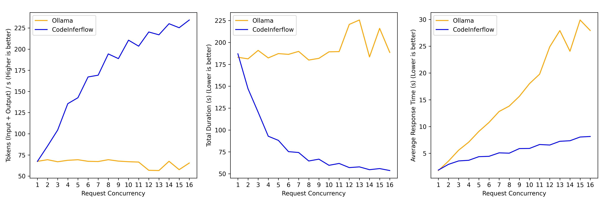

# CodeInferflow

<h4>


</h4>

[中文](./README.zh.md)

CodeInferflow is an efficient inference engine, built upon [Inferflow](https://github.com/inferflow/inferflow), specifically designed for large code language models (Code LLMs). It enables efficient, local deployment of popular Code LLMs, providing APIs for code completion.

CodeInferflow is highly efficient when concurrently serving multiple requests, and supports various data types, model file formats, and network types. CodeInferflow is highly configurable and extensible, supporting a wide range of Code LLMs and enabling users to customize their models.

## Features
1. **Popular Code LLMs Support**

Support code_llama2, codegeex2, deepseek_coder, starcoder2 and so on. Other models can be supported by editing a model specification file.

2. **API for Plugin in IDEs**

You can use [Llama Coder extension](https://marketplace.visualstudio.com/items?itemName=ex3ndr.llama-coder) in VSCode for code completion.
<h4>
<center>

</center>
</h4>
<!--  -->

3. **Efficient Code Inference**

With dynamic batching, the inference thoughtput and request response time is optimized when concurrent requests are made.



Note: Above experiment are conducted on NVIDIA A100, with 1.3b code_llama2-7b model inferencing in FP16 mode. The average token length (Input + Output) per request is 125.

Extending features:
1. **Extensible and highly configurable**.
2. **Various Datatype Supporting**: F32, F16, quantization in 2-bit, 3-bit, 3.5-bit, 4-bit, 5-bit, 6-bit and 8-bit.
3. **Hybrid model partition for multi-GPU inference**: partition-by-layer (pipeline parallelism), partition-by-tensor (tensor parallelism), and hybrid partitioning (hybrid parallelism).
4. **Wide model file format support**: pickle, safetensors, llama.cpp gguf, etc.
5. **Wide network type support**: decoder-only models, encoder-only models, and encoder-decoder models, MoE models.
6. **GPU/CPU hybrid inference**: Supporting GPU-only, CPU-only, and GPU/CPU hybrid inference.

## Models with Predefined Specification Files

### Code Models
- [X] code_llama2_instruct_7b
- [X] codegeex2_6b
- [X] deepseek_coder_7b_instruct_v1.5
- [X] starcoder2-3b
- [X] codeqwen1.5_7b (unstable)

### Chat Models
34 predefined chat model specifications. See [ChatModels](./docs/ChatModels.md)

## Getting Started
### Starting inferflow_service via Pre-build Binaries

Please make sure your CUDA version >= 12.4. If you want to use the CPU version, please build the project mannually.

#### Step1: Download pre-build binaries

Download from [release](https://github.com/immocreat/CodeInferflow/releases).

#### Step2: Download models

Select a model in `data/models/code` or `data/models/chat`, such as "starcoder2-3b". Run `download.sh` or `download.win.cmd` to download the model files.

#### Step3: Edit the configuration file

Edit `inferflow_service.ini` in `bin` directory. Uncomment the model you want to use. By default, the model "starcoder2-3b" is already enabled.

#### Step4: Start inferflow_service

In `bin/release` directory, run `inferflow_service` or `inferflow_service.exe` to start the service. Or specify the configuration file path like `inferflow_service <configuration_file_path>`.

### Code Completion in IDE

After starting "inferflow_service", you can use the [Llama Coder extension](https://marketplace.visualstudio.com/items?itemName=ex3ndr.llama-coder) in VSCode for code completion.

#### Step1: Install Llama Coder Extension

Install the [Llama Coder](https://marketplace.visualstudio.com/items?itemName=ex3ndr.llama-coder) extension in VSCode.

#### Step2: Configue the extension

1. Open settings
2. Find Llarma Coder settings. (Search "@ext:ex3ndr.llama-coder")
3. Enter CodeInferflow service endpoint in "endpoint". (E.g. http://127.0.0.1:8080)
4. Change the "Model" option to "custom".
5. In "Custom Model", enter the model name you used, which should be the same name enabled in CodeInferflow config files. (E.g. deepseek_coder_1.3b_instruct)
6. Enjoy code completions.

### Build Mannually

#### Linux

To build the CUDA version, ensure that CUDA, CMake, and Ninja are installed correctly. Compatibility is crucial: your GCC and G++ versions should match the CUDA version, and the CUDA version must align with the GPU driver version. It's advisable to utilize the [NVIDIA PyTorch Docker image](https://docs.nvidia.com/deeplearning/frameworks/pytorch-release-notes/index.html) to streamline the setup process.

We build the project with following versions:
- docker image: nvcr.io/nvidia/pytorch:24.03-py3
- CUDA: 12.4
- GCC: 11.4
- G++: 11.4
- ninja 1.11.1
- cmake 3.28.3

```bash
cmake -B build -DUSE_CUDA=1 -DCMAKE_BUILD_TYPE=Release
cmake --build build --target install
```

If you want to build the cpu version, set the USE_CUDA flag to 0. However, since some activation function is not implemented yet, the cpu version may not work properly for some models.

#### Windows

For windows platform, the visual studio, CUDA and cmake should be installed properly. The build process is similar to the linux build process.

We build the project with following versions:
- Visual Studio: 2022
- CUDA: 12.4
- cmake 3.28.3

``` cmd
cmake -B build -DUSE_CUDA=1 -DCMAKE_BUILD_TYPE=Release
cmake --build build --target install --config release
```

## Model Serving Configuration

CodeInferflow offers high configurability, enabling users to customize settings such as the model, device, data type, and completion template within a single configuration file. To edit the configuration file, see [Model Serving Configuration](./docs/model_serving_config.md).

Additionally, users have the flexibility to configure new or custom models by modifying the model specification file. For detailed instructions, refer to [Model Setup Guide](./docs/model_setup.md).

## REST API Usage

Support openai format, ollama format. See [API](./docs/API.md)

## Acknowledgements
CodeInferflow is inspired by following awesome projects:
- [Inferflow](https://github.com/inferflow/inferflow)
- [llama-coder](https://github.com/ex3ndr/llama-coder)
- [llama.cpp](https://github.com/ggerganov/llama.cpp)
- [ggml](https://github.com/ggerganov/ggml)
- [Half-precision floating-point library](https://half.sourceforge.net/)