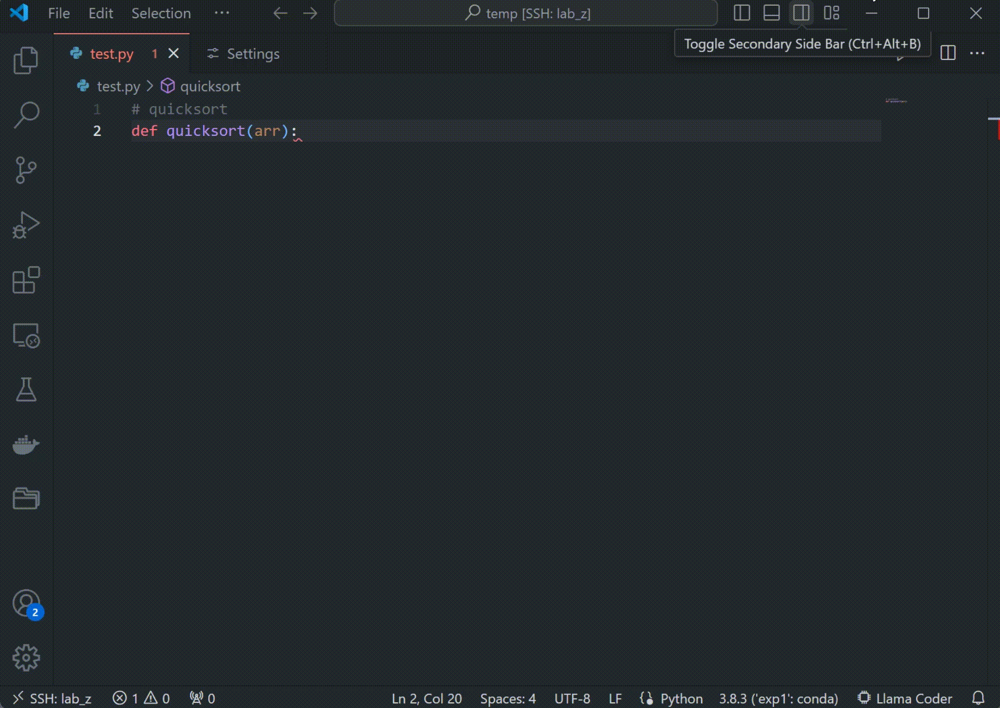
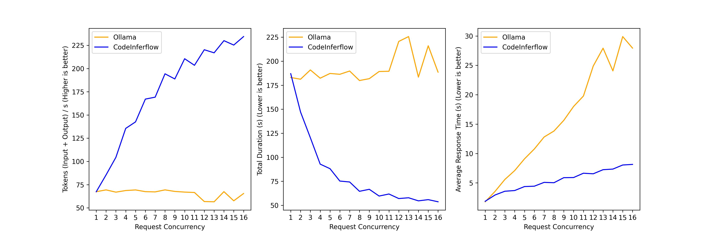

# CodeInferflow

<h4>


CodeInferflow 是一个高效的推理引擎，基于 [Inferflow](https://github.com/inferflow/inferflow) 构建，专门为大型代码语言模型（代码大型语言模型）设计。它能够高效地、本地部署流行的代码大型语言模型，提供代码补全的 API。

CodeInferflow 在同时处理多个请求时效率非常高，支持各种数据类型、模型文件格式和网络类型。同时具备高度可配置性和可扩展性，支持广泛的代码大型语言模型，并允许用户自定义他们的模型。

## 特性

1. **流行的代码大型语言模型支持**
支持 code_llama2, codegeex2, deepseek_coder, starcoder2 等。其他模型可以通过编辑模型规范文件来支持。

2. **IDE 插件 API**
您可以在 VSCode 中使用 [Llama Coder 扩展](https://marketplace.visualstudio.com/items?itemName=ex3ndr.llama-coder) 进行代码补全。

<h4>
<center>

</center>
</h4>

3. **高效的代码推理**
通过动态批处理，当并发请求时，推理吞吐量和请求响应时间得到优化。



注：上述实验是在单张 NVIDIA A100 上进行的，使用 1.3b code_llama2-7b 模型进行 FP16 模式推理。每个请求的平均Token长度（输入 + 输出）为 125。

继承功能：

1. **可扩展和高度可配置**。
2. **支持各种数据类型**：F32、F16，以及2位、3位、3.5位、4位、5位、6位和8位的量化。
3. **用于多 GPU 推理的混合模型分区**：按层分区（流水线并行）、按张量分区（张量并行）和混合分区（混合并行）。
4. **广泛的模型文件格式支持**：pickle、safetensors、llama.cpp、gguf 等。
5. **广泛的网络类型支持**：仅解码器模型、仅编码器模型和编码器-解码器模型、MoE 模型。
6. **GPU/CPU 混合推理**：支持 GPU-only、CPU-only 和 GPU/CPU 混合推理。

## 预定义配置文件的模型

### 代码补全模型

- [X] code_llama2_instruct_7b
- [X] codegeex2_6b
- [X] deepseek_coder_7b_instruct_v1.5
- [X] starcoder2-3b
- [X] codeqwen1.5_7b (unstable)

### 聊天模型

34 个预定义的聊天模型规范。请参见 [ChatModels](./docs/ChatModels.md)

## 部署CodeInferflow

### 通过预编译二进制部署

请确保您的 CUDA 版本 >= 12.4。如果您想使用 CPU 版本，请手动构建项目。

#### 步骤1：下载预编译二进制文件

请从 [release](https://github.com/immocreat/CodeInferflow/releases) 页面下载。

#### 步骤2：下载模型

在 `data/models/code` 或 `data/models/chat` 中选择一个模型，例如 "starcoder2-3b"。运行 `download.sh` 或 `download.win.cmd` 下载模型文件。

#### 步骤3：编辑配置文件

编辑 `bin` 目录中的 `inferflow_service.ini`。取消注释您想要使用的模型。默认情况下，模型 "starcoder2-3b" 已启用。

#### 步骤4：启动 inferflow_service

在 `bin/release` 目录中，运行 `inferflow_service` 或 `inferflow_service.exe` 启动服务。或者像 `inferflow_service <configuration_file_path>` 这样指定配置文件路径。

### IDE 中的代码补全

启动 "inferflow_service" 后，您可以在 VSCode 中使用 [Llama Coder 扩展](https://marketplace.visualstudio.com/items?itemName=ex3ndr.llama-coder) 进行代码补全。


#### 步骤1：安装 Llama Coder 扩展

在 VSCode 中安装 [Llama Coder](https://marketplace.visualstudio.com/items?itemName=ex3ndr.llama-coder) 扩展。

#### 步骤2：配置扩展

1. 打开设置
2. 搜索 "@ext:ex3ndr.llama-coder"，找到 `Llama Coder: Inferflow Service Host` 设置项。
3. 在 "endpoint" 中输入 CodeInferflow 服务端点。 （例如 http://127.0.0.1:8080）
4. 将 "Model" 选项更改为 "custom"。
5. 在 "Custom Model" 中输入您使用的模型名称，该名称应与 CodeInferflow 配置文件中启用的名称相同。 （例如 deepseek_coder_1.3b_instruct）
6. 享受代码补全。

### 手动构建

#### Linux

如要构建CUDA版本，请确保CUDA、CMake、Ninja、GCC和G++已正确安装。兼容性至关重要：您的GCC和G++版本应与CUDA版本匹配，CUDA版本必须与GPU驱动程序版本对齐。建议使用[NVIDIA PyTorch Docker镜像](https://docs.nvidia.com/deeplearning/frameworks/pytorch-release-notes/index.html)来简化准备过程。

我们使用以下版本构建项目：
- docker image: nvcr.io/nvidia/pytorch:24.03-py3
- CUDA: 12.4
- GCC: 11.4
- G++: 11.4
- ninja 1.11.1
- cmake 3.28.3

```bash
cmake -B build -DUSE_CUDA=1 -DCMAKE_BUILD_TYPE=Release
cmake --build build --target install
```

如需编译CPU版本，请将 `-DUSE_CUDA=1` 替换为 `-DUSE_CUDA=0`。由于某些激活函数尚未支持，某些模型可能无法在CPU版本正常运行。

#### Windows

对于Windows，您可以使用Visual Studio 2019或Visual Studio 2022构建项目。请确保安装了CUDA、CMake和Ninja。编译命令与Linux类似。

我们使用以下版本构建项目：
- Visual Studio: 2022
- CUDA: 12.4
- cmake 3.28.3

```cmd
cmake -B build -DUSE_CUDA=1 -DCMAKE_BUILD_TYPE=Release
cmake --build build --target install --config release
```

## 模型配置

CodeInferflow具备高度可配置性，用户可以自定义模型、设备、数据类型、模型切分、补全模板等。请参见 [配置文件指南](./docs/model_serving_config.md)。

除预定义的模型配置文件外，还可以通过修改配置文件适配新的模型、自定义模型。请参阅[模型适配指南](./docs/model_setup.md).

## REST API使用

支持openai格式、ollama格式。请参见 [API](./docs/API.md)

## 致谢

CodeInferflow 感谢以下项目：
- [Inferflow](https://github.com/inferflow/inferflow)
- [llama-coder](https://github.com/ex3ndr/llama-coder)
- [llama.cpp](https://github.com/ggerganov/llama.cpp)
- [ggml](https://github.com/ggerganov/ggml)
- [Half-precision floating-point library](https://half.sourceforge.net/)